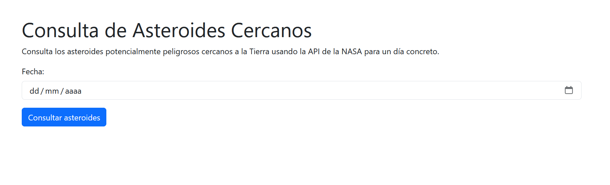
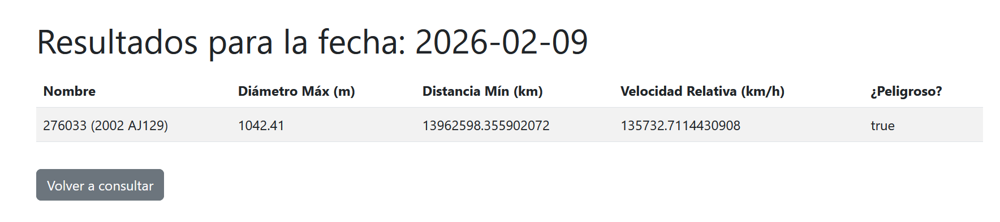

# Proyecto: Asteroides peligrosos cerca de la Tierra

## Descripción del proyecto
Esta es una aplicación web desarrollada en Spring Boot siguiendo la arquitectura MVC que permite consultar los asteroides cercanos a la Tierra para un día concreto.La aplicación utiliza la API de la NASA çy filtra los resultados para mostrar exclusivamente aquellos objetos que están catalogados como potencialmente peligrosos.

El sistema incluye una página de inicio con un formulario para seleccionar la fecha y una página que muestra una tabla con los asteroides encontrados.

## Tecnologías empleadas
* **Java + Spring Boot**:.
* **Arquitectura MVC**: Separación clara entre Modelos, Vistas y Controladores.
* **Thymeleaf**: Motor de plantillas para la generación de vistas HTML dinámicas.
* **RestTemplate**: Cliente HTTP utilizado para realizar las peticiones a la API externa de la NASA.

## Instrucciones de ejecución
1. Clonar el repositorio en la máquina local.
2. Abrir el proyecto en el IDE.
3. Ejecutar la clase `AsteroidesApplication`.
4. Abrir un navegador web y acceder a `http://localhost:8080/`.

## Capturas de pantalla de la aplicación funcionando

**Pantalla de inicio:**

**Pantalla de resultados:**
